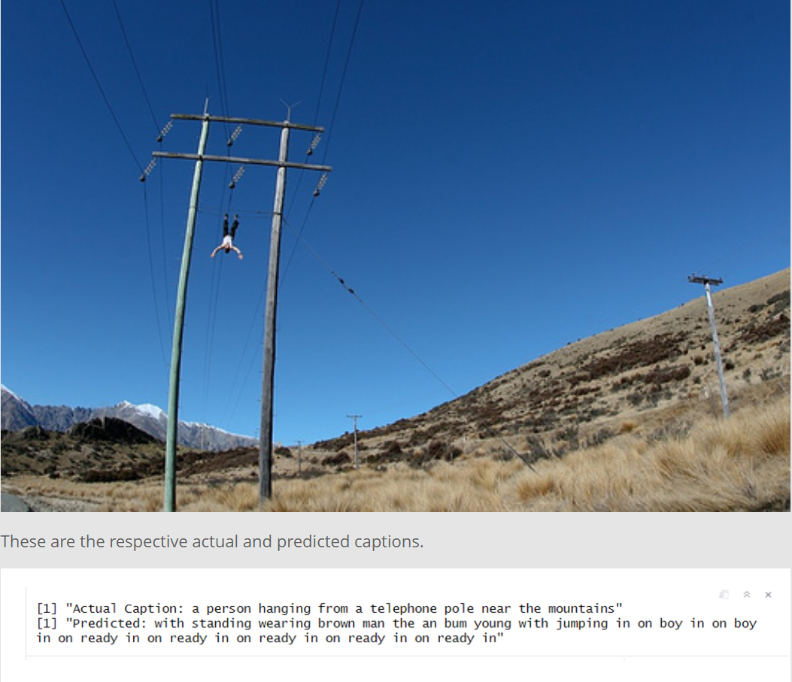

# Image Captioning Model (CNN + LSTM) — TensorFlow in R

An image captioning model trained using **TensorFlow in R**, combining a **CNN encoder** and **LSTM decoder**.

## Model overview
- CNN extracts image features (encoder)
- LSTM generates captions token-by-token (decoder)
- Tokenization + vocab building + padding

## Tech stack
- R
- TensorFlow (R interface)
- Keras 
- Dataset: Flickr8k 

### Setup
- Packages:
  - `tensorflow`, `keras`, `tidyverse` 

## Results
- Example qualitative outputs (caption samples)

## Next improvements
- Add attention mechanism
- Switch to Transformer-based decoder
- Better beam search decoding

## Report
Team06_SMLProject2023.html
